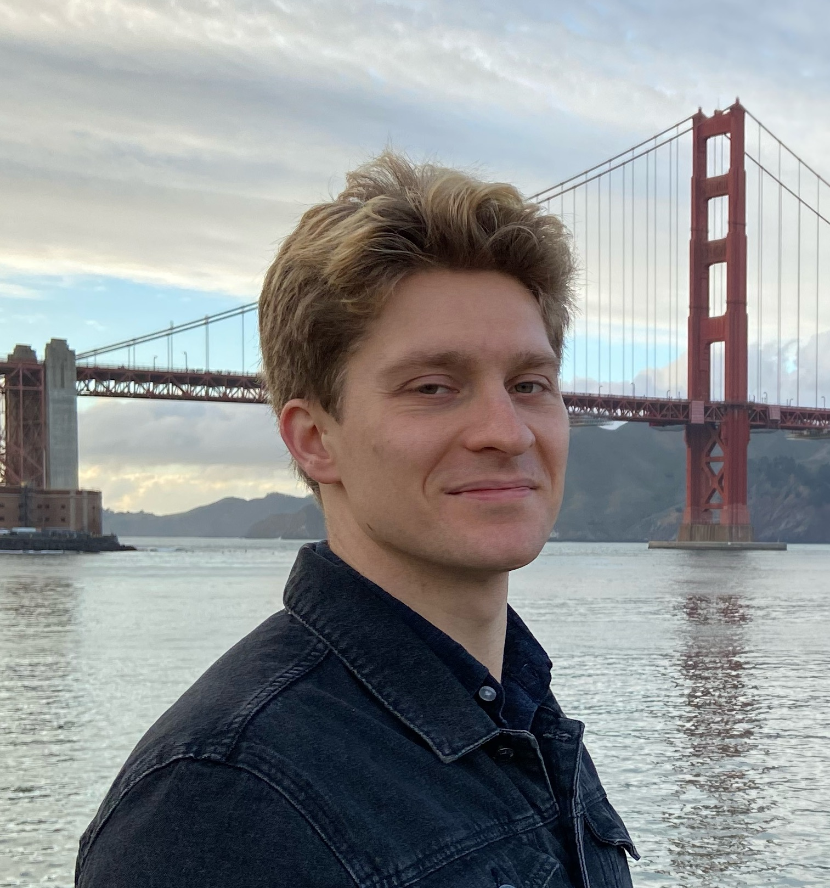

## About me

I am a quantum physicist [working](https://scholar.google.com/citations?user=fgjI_voAAAAJ&hl=en) at the intersection of quantum information and condensed matter physics. Active areas of interest include:
* Quantum error correction (Dynamical error correcting codes, Machine learning applications to decoders, QLDPC codes etc)
* Quantum simulation (Holographic simulation of tensor networks, Efficient fermionic encoding schemes)
* Exotic states of matter (Fractons, Topological order, Symmetry protected topological phases)

Currently, I am a Postdoctoral researcher at the [The Stewart Blusson Quantum Matter Institute at UBC](https://qmi.ubc.ca/). Before that I was PhD student at Yale University working under the supervision of Meng Cheng.

